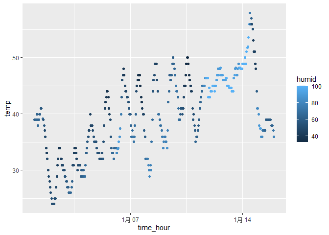

HW1_XiangxiongFeng
================
Xiangxiong Feng
2023-09-23

# Problem 1

``` r
library(moderndive)
library(tidyverse)
```

    ## ── Attaching core tidyverse packages ──────────────────────── tidyverse 2.0.0 ──
    ## ✔ dplyr     1.1.3     ✔ readr     2.1.4
    ## ✔ forcats   1.0.0     ✔ stringr   1.5.0
    ## ✔ ggplot2   3.4.3     ✔ tibble    3.2.1
    ## ✔ lubridate 1.9.2     ✔ tidyr     1.3.0
    ## ✔ purrr     1.0.2     
    ## ── Conflicts ────────────────────────────────────────── tidyverse_conflicts() ──
    ## ✖ dplyr::filter() masks stats::filter()
    ## ✖ dplyr::lag()    masks stats::lag()
    ## ℹ Use the conflicted package (<http://conflicted.r-lib.org/>) to force all conflicts to become errors

``` r
data("early_january_weather")
head(early_january_weather)
```

    ## # A tibble: 6 × 15
    ##   origin  year month   day  hour  temp  dewp humid wind_dir wind_speed wind_gust
    ##   <chr>  <int> <int> <int> <int> <dbl> <dbl> <dbl>    <dbl>      <dbl>     <dbl>
    ## 1 EWR     2013     1     1     1  39.0  26.1  59.4      270      10.4         NA
    ## 2 EWR     2013     1     1     2  39.0  27.0  61.6      250       8.06        NA
    ## 3 EWR     2013     1     1     3  39.0  28.0  64.4      240      11.5         NA
    ## 4 EWR     2013     1     1     4  39.9  28.0  62.2      250      12.7         NA
    ## 5 EWR     2013     1     1     5  39.0  28.0  64.4      260      12.7         NA
    ## 6 EWR     2013     1     1     6  37.9  28.0  67.2      240      11.5         NA
    ## # ℹ 4 more variables: precip <dbl>, pressure <dbl>, visib <dbl>,
    ## #   time_hour <dttm>

``` r
#import 'early_january_weather'

nrow(early_january_weather)
```

    ## [1] 358

``` r
ncol(early_january_weather)
```

    ## [1] 15

``` r
#size of the dataset

mean(early_january_weather$temp)
```

    ## [1] 39.58212

``` r
mean(early_january_weather$humid)
```

    ## [1] 65.4767

``` r
mean(early_january_weather$dewp)
```

    ## [1] 28.05709

``` r
#the mean of important variables

#description: the data includes 15 variables. Some important variables are time_hour, temp, humid and dewp. The mean temperature in this data is 39.58212.

ggplot(data = early_january_weather,aes(x = time_hour, y = temp, color = humid)) + geom_point()
```

<!-- -->

``` r
ggsave("tempvstime_hour.pdf", height = 4, width = 6)
```

    ## Warning in grid.Call(C_textBounds, as.graphicsAnnot(x$label), x$x, x$y, :
    ## 'mbcsToSbcs'里转换'1月 07'出错：<e6>代替了dot

    ## Warning in grid.Call(C_textBounds, as.graphicsAnnot(x$label), x$x, x$y, :
    ## 'mbcsToSbcs'里转换'1月 07'出错：<9c>代替了dot

    ## Warning in grid.Call(C_textBounds, as.graphicsAnnot(x$label), x$x, x$y, :
    ## 'mbcsToSbcs'里转换'1月 07'出错：<88>代替了dot

    ## Warning in grid.Call(C_textBounds, as.graphicsAnnot(x$label), x$x, x$y, :
    ## 'mbcsToSbcs'里转换'1月 14'出错：<e6>代替了dot

    ## Warning in grid.Call(C_textBounds, as.graphicsAnnot(x$label), x$x, x$y, :
    ## 'mbcsToSbcs'里转换'1月 14'出错：<9c>代替了dot

    ## Warning in grid.Call(C_textBounds, as.graphicsAnnot(x$label), x$x, x$y, :
    ## 'mbcsToSbcs'里转换'1月 14'出错：<88>代替了dot

    ## Warning in grid.Call(C_textBounds, as.graphicsAnnot(x$label), x$x, x$y, :
    ## 'mbcsToSbcs'里转换'1月 07'出错：<e6>代替了dot

    ## Warning in grid.Call(C_textBounds, as.graphicsAnnot(x$label), x$x, x$y, :
    ## 'mbcsToSbcs'里转换'1月 07'出错：<9c>代替了dot

    ## Warning in grid.Call(C_textBounds, as.graphicsAnnot(x$label), x$x, x$y, :
    ## 'mbcsToSbcs'里转换'1月 07'出错：<88>代替了dot

    ## Warning in grid.Call(C_textBounds, as.graphicsAnnot(x$label), x$x, x$y, :
    ## 'mbcsToSbcs'里转换'1月 14'出错：<e6>代替了dot

    ## Warning in grid.Call(C_textBounds, as.graphicsAnnot(x$label), x$x, x$y, :
    ## 'mbcsToSbcs'里转换'1月 14'出错：<9c>代替了dot

    ## Warning in grid.Call(C_textBounds, as.graphicsAnnot(x$label), x$x, x$y, :
    ## 'mbcsToSbcs'里转换'1月 14'出错：<88>代替了dot

    ## Warning in grid.Call(C_textBounds, as.graphicsAnnot(x$label), x$x, x$y, :
    ## 'mbcsToSbcs'里转换'1月 07'出错：<e6>代替了dot

    ## Warning in grid.Call(C_textBounds, as.graphicsAnnot(x$label), x$x, x$y, :
    ## 'mbcsToSbcs'里转换'1月 07'出错：<9c>代替了dot

    ## Warning in grid.Call(C_textBounds, as.graphicsAnnot(x$label), x$x, x$y, :
    ## 'mbcsToSbcs'里转换'1月 07'出错：<88>代替了dot

    ## Warning in grid.Call(C_textBounds, as.graphicsAnnot(x$label), x$x, x$y, :
    ## 'mbcsToSbcs'里转换'1月 14'出错：<e6>代替了dot

    ## Warning in grid.Call(C_textBounds, as.graphicsAnnot(x$label), x$x, x$y, :
    ## 'mbcsToSbcs'里转换'1月 14'出错：<9c>代替了dot

    ## Warning in grid.Call(C_textBounds, as.graphicsAnnot(x$label), x$x, x$y, :
    ## 'mbcsToSbcs'里转换'1月 14'出错：<88>代替了dot

    ## Warning in grid.Call(C_textBounds, as.graphicsAnnot(x$label), x$x, x$y, :
    ## 'mbcsToSbcs'里转换'1月 07'出错：<e6>代替了dot

    ## Warning in grid.Call(C_textBounds, as.graphicsAnnot(x$label), x$x, x$y, :
    ## 'mbcsToSbcs'里转换'1月 07'出错：<9c>代替了dot

    ## Warning in grid.Call(C_textBounds, as.graphicsAnnot(x$label), x$x, x$y, :
    ## 'mbcsToSbcs'里转换'1月 07'出错：<88>代替了dot

    ## Warning in grid.Call(C_textBounds, as.graphicsAnnot(x$label), x$x, x$y, :
    ## 'mbcsToSbcs'里转换'1月 14'出错：<e6>代替了dot

    ## Warning in grid.Call(C_textBounds, as.graphicsAnnot(x$label), x$x, x$y, :
    ## 'mbcsToSbcs'里转换'1月 14'出错：<9c>代替了dot

    ## Warning in grid.Call(C_textBounds, as.graphicsAnnot(x$label), x$x, x$y, :
    ## 'mbcsToSbcs'里转换'1月 14'出错：<88>代替了dot

    ## Warning in grid.Call(C_textBounds, as.graphicsAnnot(x$label), x$x, x$y, :
    ## 'mbcsToSbcs'里转换'1月 07'出错：<e6>代替了dot

    ## Warning in grid.Call(C_textBounds, as.graphicsAnnot(x$label), x$x, x$y, :
    ## 'mbcsToSbcs'里转换'1月 07'出错：<9c>代替了dot

    ## Warning in grid.Call(C_textBounds, as.graphicsAnnot(x$label), x$x, x$y, :
    ## 'mbcsToSbcs'里转换'1月 07'出错：<88>代替了dot

    ## Warning in grid.Call(C_textBounds, as.graphicsAnnot(x$label), x$x, x$y, :
    ## 'mbcsToSbcs'里转换'1月 14'出错：<e6>代替了dot

    ## Warning in grid.Call(C_textBounds, as.graphicsAnnot(x$label), x$x, x$y, :
    ## 'mbcsToSbcs'里转换'1月 14'出错：<9c>代替了dot

    ## Warning in grid.Call(C_textBounds, as.graphicsAnnot(x$label), x$x, x$y, :
    ## 'mbcsToSbcs'里转换'1月 14'出错：<88>代替了dot

    ## Warning in grid.Call(C_textBounds, as.graphicsAnnot(x$label), x$x, x$y, :
    ## 'mbcsToSbcs'里转换'1月 07'出错：<e6>代替了dot

    ## Warning in grid.Call(C_textBounds, as.graphicsAnnot(x$label), x$x, x$y, :
    ## 'mbcsToSbcs'里转换'1月 07'出错：<9c>代替了dot

    ## Warning in grid.Call(C_textBounds, as.graphicsAnnot(x$label), x$x, x$y, :
    ## 'mbcsToSbcs'里转换'1月 07'出错：<88>代替了dot

    ## Warning in grid.Call(C_textBounds, as.graphicsAnnot(x$label), x$x, x$y, :
    ## 'mbcsToSbcs'里转换'1月 14'出错：<e6>代替了dot

    ## Warning in grid.Call(C_textBounds, as.graphicsAnnot(x$label), x$x, x$y, :
    ## 'mbcsToSbcs'里转换'1月 14'出错：<9c>代替了dot

    ## Warning in grid.Call(C_textBounds, as.graphicsAnnot(x$label), x$x, x$y, :
    ## 'mbcsToSbcs'里转换'1月 14'出错：<88>代替了dot

    ## Warning in grid.Call(C_textBounds, as.graphicsAnnot(x$label), x$x, x$y, :
    ## 'mbcsToSbcs'里转换'1月 07'出错：<e6>代替了dot

    ## Warning in grid.Call(C_textBounds, as.graphicsAnnot(x$label), x$x, x$y, :
    ## 'mbcsToSbcs'里转换'1月 07'出错：<9c>代替了dot

    ## Warning in grid.Call(C_textBounds, as.graphicsAnnot(x$label), x$x, x$y, :
    ## 'mbcsToSbcs'里转换'1月 07'出错：<88>代替了dot

    ## Warning in grid.Call(C_textBounds, as.graphicsAnnot(x$label), x$x, x$y, :
    ## 'mbcsToSbcs'里转换'1月 14'出错：<e6>代替了dot

    ## Warning in grid.Call(C_textBounds, as.graphicsAnnot(x$label), x$x, x$y, :
    ## 'mbcsToSbcs'里转换'1月 14'出错：<9c>代替了dot

    ## Warning in grid.Call(C_textBounds, as.graphicsAnnot(x$label), x$x, x$y, :
    ## 'mbcsToSbcs'里转换'1月 14'出错：<88>代替了dot

    ## Warning in grid.Call(C_textBounds, as.graphicsAnnot(x$label), x$x, x$y, :
    ## 'mbcsToSbcs'里转换'1月 07'出错：<e6>代替了dot

    ## Warning in grid.Call(C_textBounds, as.graphicsAnnot(x$label), x$x, x$y, :
    ## 'mbcsToSbcs'里转换'1月 07'出错：<9c>代替了dot

    ## Warning in grid.Call(C_textBounds, as.graphicsAnnot(x$label), x$x, x$y, :
    ## 'mbcsToSbcs'里转换'1月 07'出错：<88>代替了dot

    ## Warning in grid.Call(C_textBounds, as.graphicsAnnot(x$label), x$x, x$y, :
    ## 'mbcsToSbcs'里转换'1月 14'出错：<e6>代替了dot

    ## Warning in grid.Call(C_textBounds, as.graphicsAnnot(x$label), x$x, x$y, :
    ## 'mbcsToSbcs'里转换'1月 14'出错：<9c>代替了dot

    ## Warning in grid.Call(C_textBounds, as.graphicsAnnot(x$label), x$x, x$y, :
    ## 'mbcsToSbcs'里转换'1月 14'出错：<88>代替了dot

    ## Warning in grid.Call(C_textBounds, as.graphicsAnnot(x$label), x$x, x$y, :
    ## 'mbcsToSbcs'里转换'1月 07'出错：<e6>代替了dot

    ## Warning in grid.Call(C_textBounds, as.graphicsAnnot(x$label), x$x, x$y, :
    ## 'mbcsToSbcs'里转换'1月 07'出错：<9c>代替了dot

    ## Warning in grid.Call(C_textBounds, as.graphicsAnnot(x$label), x$x, x$y, :
    ## 'mbcsToSbcs'里转换'1月 07'出错：<88>代替了dot

    ## Warning in grid.Call(C_textBounds, as.graphicsAnnot(x$label), x$x, x$y, :
    ## 'mbcsToSbcs'里转换'1月 14'出错：<e6>代替了dot

    ## Warning in grid.Call(C_textBounds, as.graphicsAnnot(x$label), x$x, x$y, :
    ## 'mbcsToSbcs'里转换'1月 14'出错：<9c>代替了dot

    ## Warning in grid.Call(C_textBounds, as.graphicsAnnot(x$label), x$x, x$y, :
    ## 'mbcsToSbcs'里转换'1月 14'出错：<88>代替了dot

    ## Warning in grid.Call(C_textBounds, as.graphicsAnnot(x$label), x$x, x$y, :
    ## 'mbcsToSbcs'里转换'1月 07'出错：<e6>代替了dot

    ## Warning in grid.Call(C_textBounds, as.graphicsAnnot(x$label), x$x, x$y, :
    ## 'mbcsToSbcs'里转换'1月 07'出错：<9c>代替了dot

    ## Warning in grid.Call(C_textBounds, as.graphicsAnnot(x$label), x$x, x$y, :
    ## 'mbcsToSbcs'里转换'1月 07'出错：<88>代替了dot

    ## Warning in grid.Call(C_textBounds, as.graphicsAnnot(x$label), x$x, x$y, :
    ## 'mbcsToSbcs'里转换'1月 14'出错：<e6>代替了dot

    ## Warning in grid.Call(C_textBounds, as.graphicsAnnot(x$label), x$x, x$y, :
    ## 'mbcsToSbcs'里转换'1月 14'出错：<9c>代替了dot

    ## Warning in grid.Call(C_textBounds, as.graphicsAnnot(x$label), x$x, x$y, :
    ## 'mbcsToSbcs'里转换'1月 14'出错：<88>代替了dot

    ## Warning in grid.Call(C_textBounds, as.graphicsAnnot(x$label), x$x, x$y, :
    ## 'mbcsToSbcs'里转换'1月 07'出错：<e6>代替了dot

    ## Warning in grid.Call(C_textBounds, as.graphicsAnnot(x$label), x$x, x$y, :
    ## 'mbcsToSbcs'里转换'1月 07'出错：<9c>代替了dot

    ## Warning in grid.Call(C_textBounds, as.graphicsAnnot(x$label), x$x, x$y, :
    ## 'mbcsToSbcs'里转换'1月 07'出错：<88>代替了dot

    ## Warning in grid.Call(C_textBounds, as.graphicsAnnot(x$label), x$x, x$y, :
    ## 'mbcsToSbcs'里转换'1月 14'出错：<e6>代替了dot

    ## Warning in grid.Call(C_textBounds, as.graphicsAnnot(x$label), x$x, x$y, :
    ## 'mbcsToSbcs'里转换'1月 14'出错：<9c>代替了dot

    ## Warning in grid.Call(C_textBounds, as.graphicsAnnot(x$label), x$x, x$y, :
    ## 'mbcsToSbcs'里转换'1月 14'出错：<88>代替了dot

    ## Warning in grid.Call(C_textBounds, as.graphicsAnnot(x$label), x$x, x$y, :
    ## 'mbcsToSbcs'里转换'1月 07'出错：<e6>代替了dot

    ## Warning in grid.Call(C_textBounds, as.graphicsAnnot(x$label), x$x, x$y, :
    ## 'mbcsToSbcs'里转换'1月 07'出错：<9c>代替了dot

    ## Warning in grid.Call(C_textBounds, as.graphicsAnnot(x$label), x$x, x$y, :
    ## 'mbcsToSbcs'里转换'1月 07'出错：<88>代替了dot

    ## Warning in grid.Call(C_textBounds, as.graphicsAnnot(x$label), x$x, x$y, :
    ## 'mbcsToSbcs'里转换'1月 14'出错：<e6>代替了dot

    ## Warning in grid.Call(C_textBounds, as.graphicsAnnot(x$label), x$x, x$y, :
    ## 'mbcsToSbcs'里转换'1月 14'出错：<9c>代替了dot

    ## Warning in grid.Call(C_textBounds, as.graphicsAnnot(x$label), x$x, x$y, :
    ## 'mbcsToSbcs'里转换'1月 14'出错：<88>代替了dot

    ## Warning in grid.Call(C_textBounds, as.graphicsAnnot(x$label), x$x, x$y, :
    ## 'mbcsToSbcs'里转换'1月 07'出错：<e6>代替了dot

    ## Warning in grid.Call(C_textBounds, as.graphicsAnnot(x$label), x$x, x$y, :
    ## 'mbcsToSbcs'里转换'1月 07'出错：<9c>代替了dot

    ## Warning in grid.Call(C_textBounds, as.graphicsAnnot(x$label), x$x, x$y, :
    ## 'mbcsToSbcs'里转换'1月 07'出错：<88>代替了dot

    ## Warning in grid.Call(C_textBounds, as.graphicsAnnot(x$label), x$x, x$y, :
    ## 'mbcsToSbcs'里转换'1月 14'出错：<e6>代替了dot

    ## Warning in grid.Call(C_textBounds, as.graphicsAnnot(x$label), x$x, x$y, :
    ## 'mbcsToSbcs'里转换'1月 14'出错：<9c>代替了dot

    ## Warning in grid.Call(C_textBounds, as.graphicsAnnot(x$label), x$x, x$y, :
    ## 'mbcsToSbcs'里转换'1月 14'出错：<88>代替了dot

    ## Warning in grid.Call.graphics(C_text, as.graphicsAnnot(x$label), x$x, x$y, :
    ## 'mbcsToSbcs'里转换'1月 07'出错：<e6>代替了dot

    ## Warning in grid.Call.graphics(C_text, as.graphicsAnnot(x$label), x$x, x$y, :
    ## 'mbcsToSbcs'里转换'1月 07'出错：<9c>代替了dot

    ## Warning in grid.Call.graphics(C_text, as.graphicsAnnot(x$label), x$x, x$y, :
    ## 'mbcsToSbcs'里转换'1月 07'出错：<88>代替了dot

    ## Warning in grid.Call.graphics(C_text, as.graphicsAnnot(x$label), x$x, x$y, :
    ## 'mbcsToSbcs'里转换'1月 07'出错：<e6>代替了dot

    ## Warning in grid.Call.graphics(C_text, as.graphicsAnnot(x$label), x$x, x$y, :
    ## 'mbcsToSbcs'里转换'1月 07'出错：<9c>代替了dot

    ## Warning in grid.Call.graphics(C_text, as.graphicsAnnot(x$label), x$x, x$y, :
    ## 'mbcsToSbcs'里转换'1月 07'出错：<88>代替了dot

    ## Warning in grid.Call.graphics(C_text, as.graphicsAnnot(x$label), x$x, x$y, :
    ## 'mbcsToSbcs'里转换'1月 14'出错：<e6>代替了dot

    ## Warning in grid.Call.graphics(C_text, as.graphicsAnnot(x$label), x$x, x$y, :
    ## 'mbcsToSbcs'里转换'1月 14'出错：<9c>代替了dot

    ## Warning in grid.Call.graphics(C_text, as.graphicsAnnot(x$label), x$x, x$y, :
    ## 'mbcsToSbcs'里转换'1月 14'出错：<88>代替了dot

    ## Warning in grid.Call.graphics(C_text, as.graphicsAnnot(x$label), x$x, x$y, :
    ## 'mbcsToSbcs'里转换'1月 14'出错：<e6>代替了dot

    ## Warning in grid.Call.graphics(C_text, as.graphicsAnnot(x$label), x$x, x$y, :
    ## 'mbcsToSbcs'里转换'1月 14'出错：<9c>代替了dot

    ## Warning in grid.Call.graphics(C_text, as.graphicsAnnot(x$label), x$x, x$y, :
    ## 'mbcsToSbcs'里转换'1月 14'出错：<88>代替了dot

``` r
#scatterplot of temp (y) vs time_hour (x)
```

# Problem 2

``` r
dat = rnorm(10)
logical_vector = dat > 0
character_vector = c(1:10)
factor_vector = factor(rep(c("Level1", "Level2", "Level3"), length.out = 10))

df = data.frame( Number = dat,
  Logical = logical_vector,
  Character = character_vector,
  Factor = factor_vector
)
df
```

    ##        Number Logical Character Factor
    ## 1   0.7846047    TRUE         1 Level1
    ## 2  -0.8815284   FALSE         2 Level2
    ## 3   1.0799600    TRUE         3 Level3
    ## 4   1.7918855    TRUE         4 Level1
    ## 5   0.1749257    TRUE         5 Level2
    ## 6   0.7757865    TRUE         6 Level3
    ## 7   0.6011883    TRUE         7 Level1
    ## 8   0.3392339    TRUE         8 Level2
    ## 9  -1.3738353   FALSE         9 Level3
    ## 10 -0.7347241   FALSE        10 Level1

``` r
# created a data frame

Number = pull(df, Number)
mean(Number)
```

    ## [1] 0.2557497

``` r
#mean of Number
```

Only the random_sample itself can take the mean. Because the other three
are not numeric .

``` r
Logical = pull(df, Logical)
Character = pull(df, Character)
Factor = pull(df, Factor)
as.numeric(Logical)
```

    ##  [1] 1 0 1 1 1 1 1 1 0 0

``` r
as.numeric(Character)
```

    ##  [1]  1  2  3  4  5  6  7  8  9 10

``` r
as.numeric(Factor)
```

    ##  [1] 1 2 3 1 2 3 1 2 3 1

Now there are numeric but still follow certain patterns such as 1 =
True, 0 = False. This dose help explain what happens when you try to
take the mean.
